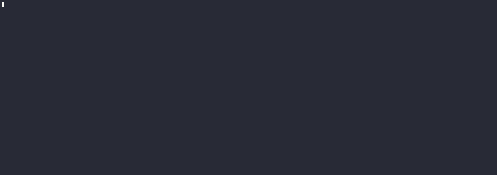

# Cистеми на базі Kubernetes для локальної розробки. 
## Опис інструментів та їх призначення

## Minikube
Запускає single-node кластер Kubernetes з control plane та worker node на локальному комп’ютері. Основне призначення - максимально спростити роботу з Kubernetes для розробників, легко і безкоштовно розгортаючи кластер для навчання та експериментів, локальної розробки та тестування
## KinD (Kubernetes in Docker)
 Використовує звичайні контейнери Docker (або Podman) як nodes для кластера
## k3d
Легка та швидка утиліта, яка дозволяє запускати k3s прямо всередині Docker.

## Порівняльна таблиця

| Критерій                              | Minikube                                      | KinD /                                      | k3d                                                        |                                                 |
|-------------------------------------|-------------------------------------------------------------------|---------------------------------------------------------------------|--------------------------------------------------------------------------------------|-----------------------------------------------------------------------------------|
| Підтримувані ОС      | Windows, macOS, Linux                          | Windows, macOS, Linux         | Windows, macOS, Linux                           networking solutions                          |
| Архітектура                     | Віртуальні машини (за замовчуванням) або Docker. Переважно 1 нода                  | Кожна нода — це окремий контейнер Docker.     | Кожна нода — це легкий контейнер із k3s всередині                  |
| Швидкість розгортання  | Повільна (від 1 до 5 хв) через підняття VM                   | Швидка (30–60 сек). | Дуже швидко (5–20 сек) |
| Ресурси (ОЗП/Процесор) |  Високе споживання (потрібно від 2 ГБ ОЗП)                     | Середнє (залежить від кількості нод) | Надзвичайно низьке (оптимізовано для слабких машин)      |
| Автоматизація (CI/CD)            | Складно використовувати в пайплайнах через важкість           | Ідеально. Створений спеціально для тестів у CI/CD             | Чудово. Легко розгортається в автоматизованих скриптах             |
| Додаткові функції       | Багатий вибір вбудованих аддонів (Ingress, Dashboard, Metrics)                                        | Багатий вибір вбудованих аддонів (Ingress, Dashboard, Metrics)                     | Вбудований Ingress (Traefik) та Local Registry                         |
| Моніторинг                        | Легко вмикається через команду addons enable | Потребує самостійного встановлення Prometheus/Grafana        | Потребує самостійного встановлення стеків моніторингу                            | 
| Стабільність роботи                        | Висока. Проєкт зрілий і перевірений часом                           | Висока. Проєкт зрілий і перевірений часом                               | Висока. Надійний, базується на продакшн-версії k3s                                                                                                 |       
| Документація та Спільнота                        | Найкраща документація та величезна спільнота                           | Добра документація, активна підтримка CNCF                               | Хороша документація, підтримується компанією Rancher                                                                                                 |   
| Складність використання                              | Дуже легкий старт для початківців                           | Потребує розуміння концепції контейнерів                            | Простий, але вимагає базових знань Docker                                                                                               |      

### Давайте спробуємо використовувати для нашого проекту k3d
Якщо дуже коротко, то додаток можна розгортути таким чином

