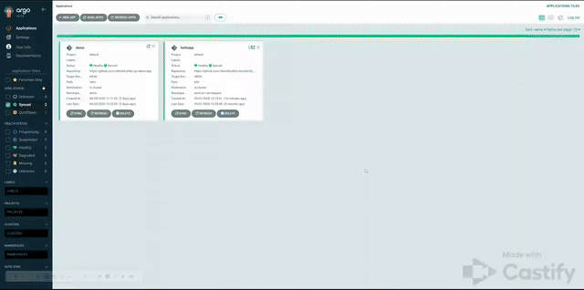

# Auto Sync Demonstration
Since POC.md demonstrates how manual synchronization is performed, part of the work required for this task was already completed in the previous task.

A second application was registered to verify that automatic synchronization functions correctly.

The auto-sync mechanism is working as expected. After modifying the number of replicas in the deployment, the changes were automatically applied within approximately 2–3 minutes.

Bellow is a short video demonstrates this option:

 