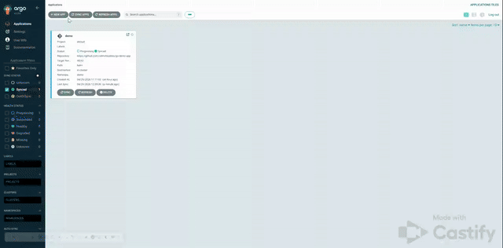

# HOW TO USE ARGOCD 
ArgoCD continuous delivery tool for Kubernetes has been deployed and ready to use in local network via address https://10.44.24.57:8080/
You can easily sync project changes and check result in test environment. Sync works in manual mode and can be switched to auto.
Bellow is short video how it works

  

